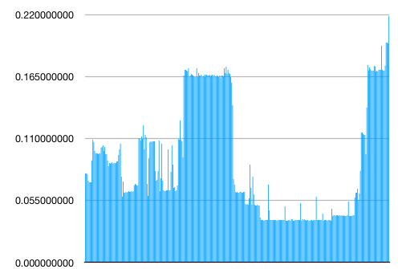
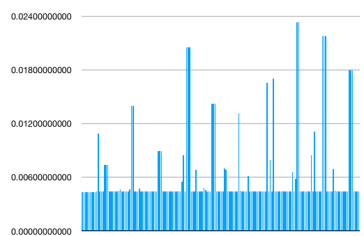
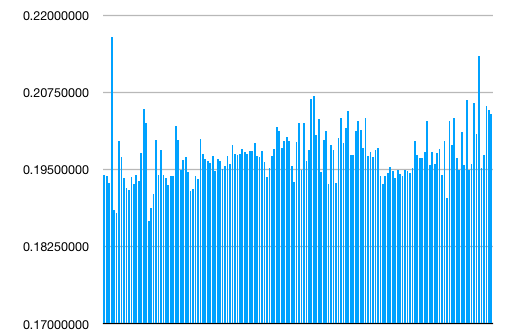
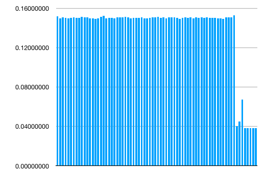
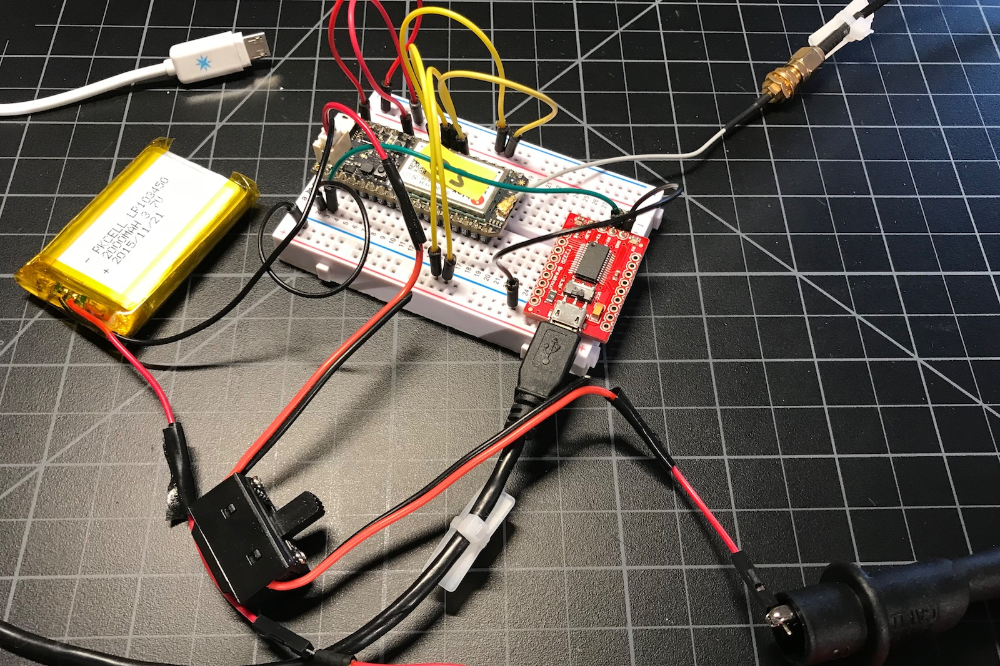
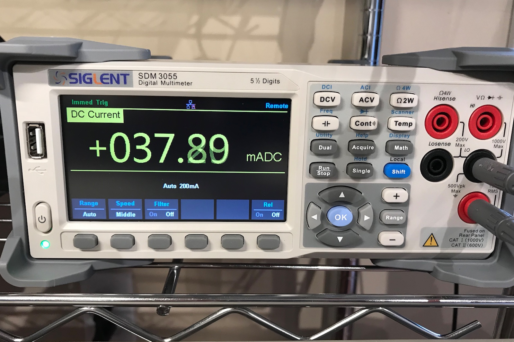

# Choosing an Electron sleep mode

There are several sleep modes available on the Electron, and choosing the correct one can make a large difference in the amount of battery usage, data, and time to connect. There is no one best method, however it mostly depends on the amount of time you plan to sleep.

There is also a [wildly inaccurate calculator](https://rickkas7.github.io/electron-battery) that you can use to get a wild guess of how long a battery will last and how much data it will use.

Updates to this document can be found [on Github](https://github.com/rickkas7/electron-power-data-usage) along with the test code.

## The four sleep modes

There are basically four sleep modes.

- Idle (not sleeping): 56.7 mA
- Stop mode (pin + time) with SLEEP\_NETWORK\_STANDBY: 6.53 mA
- Stop mode (pin + time): 2.75 mA
- SLEEP\_MODE\_DEEP: 161 &mu;A <sup>&dagger;</sup>
- SLEEP\_MODE\_SOFTPOWEROFF: 110 &mu;A

All were tested in 0.7.0 on an Electron 3G Americas (U260) with system threading off.

<sup>&dagger;</sup>There is also SLEEP\_MODE\_DEEP with SLEEP\_NETWORK\_STANDBY but I can find no discernible difference vs. regular SLEEP\_MODE\_DEEP. Both use 161 &mu;A and both require a cellular reconnection when waking from sleep.

## Cellular connection

In any of the mode other than stop mode (pin + time) with SLEEP\_NETWORK\_STANDBY it's necessary to reconnect to cellular after waking up from sleep. This is the blinking green phase.

This takes between 24 and 60 seconds (or more) so this will affect your energy usage. It doesn't affect your data usage, however, as connecting to a cellular tower doesn't count against your data usage.
	
Somewhat surprisingly, this is not always the most-power intensive portion of the connection. In this example, connecting by 3G took:

- 24.2 seconds
- 2.15 amp-seconds of energy
- An average of 89 mA (with higher peaks)



This graph might be a little low, as really short spikes in power usage were likely missed by my meter but it's a reasonable approximation. Y axis is amps.

I use amp-seconds because the numbers are a reasonable size and are a logical measurement as I measure the number of amps many times per second, so I can take the average, then multiply by the number of seconds to get the total amp-seconds. You can convert this to other more common measurements like amp-hours by dividing by 3600, or watt-hours by multiplying by 3.6V and dividing by 3600.

There isn't much printed in the debug log for the cellular connection at INFO level. It typically looks like this:

```
0000004745 [system] INFO: Sim Ready
0000004745 [system] INFO: ARM_WLAN_WD 1
0000024629 [system] INFO: ARM_WLAN_WD 2
0000024629 [system] INFO: CLR_WLAN_WD 1, DHCP success
```

## SLEEP\_NETWORK\_STANDBY

Using stop mode sleep (pin + time) with SLEEP\_NETWORK\_STANDBY can save time and power by eliminating the need to reconnect to the cellular network, the blinking green step. The average idle power consumption is 6.53 mA, but it really is about 4.5 mA with occasional spikes; these are where the cellular modem is communicating with the tower to keep the connection alive. Y axis is amps.



This information can help make a determination if you want to keep cellular up, however. Given these two options:

- Stop mode (pin + time) with SLEEP\_NETWORK\_STANDBY: 6.53 mA
- SLEEP\_MODE\_SOFTPOWEROFF: 110 &mu;A

Given the difference of 0.006240 A, it takes 334 seconds (about 5 1/2 minutes) of SLEEP\_MODE\_SOFTPOWEROFF to offset the energy used to reconnect to cellular.

Of course if you need to wake up quickly, you may want to use SLEEP\_NETWORK\_STANDBY for even longer sleep periods, just to save the 24 to 60 seconds to reconnect to cellular.

The only situation where you'd likely use stop mode sleep (pin + time) without using SLEEP\_NETWORK\_STANDBY is if you need to wake up to take a measurement frequently, but only upload those measurements infrequently (more than every 15 minutes or so).

The full test of doing a publish (below) takes into account other areas of overhead which makes stop mode (pin + time) with SLEEP\_NETWORK\_STANDBY advantageous in even longer sleep durations.

## Cloud handshake

After connecting to the cloud, a handshake must be done. This involves:

- DNS lookup
- DTLS handshake
- RSA key exchange

And uses:

- 11.62 seconds
- 2.29 amp-seconds of energy
- An average of 198 mA (with higher peaks)
- 3579 bytes of data



A full handshake in the debug log looks like this:

```
0000024661 [system] INFO: Cloud: connecting
0000024709 [system] INFO: Read Server Address = type:1,domain:$id.udp.particle.io
0000025507 [system] INFO: Resolved host <deviceid>.udp.particle.io to 54.158.29.30
0000025632 [system] INFO: Cloud socket connected
0000025632 [system] INFO: Starting handshake: presense_announce=0
0000025686 [comm.protocol.handshake] INFO: Establish secure connection
0000025769 [comm.dtls] INFO: (CMPL,RENEG,NO_SESS,ERR) restoreStatus=2
0000031911 [comm.protocol.handshake] INFO: Sending HELLO message
0000034547 [comm.protocol.handshake] INFO: Handshake completed
0000034547 [system] INFO: Send spark/device/claim/code event
0000034824 [system] INFO: Send spark/device/last_reset event
0000035037 [system] INFO: Send subscriptions
0000035248 [comm.dtls] INFO: session cmd (CLS,DIS,MOV,LOD,SAV): 4
0000035250 [comm.dtls] INFO: session cmd (CLS,DIS,MOV,LOD,SAV): 3
0000035320 [comm] INFO: Sending TIME request
0000035619 [comm.protocol] INFO: rcv'd message type=13
0000035619 [system] INFO: Cloud connected
```

This is the blinking cyan and fast blinking cyan phase.

## Session Restore

However, in many cases the session can be restored instead of renegotiating it. This saves time, energy and data.

There are two levels of session restore. The longer form typically occurs with SLEEP\_MODE\_DEEP:

```
0000001340 [system] INFO: Cloud: connecting
0000001388 [system] INFO: Read Server Address = type:1,domain:$id.udp.particle.io
0000001844 [system] INFO: Cloud socket connected
0000001844 [system] INFO: Starting handshake: presense_announce=0
0000001898 [comm.protocol.handshake] INFO: Establish secure connection
0000001985 [comm.dtls] INFO: (CMPL,RENEG,NO_SESS,ERR) restoreStatus=0
0000002047 [comm.dtls] INFO: out_ctr 0,1,0,0,0,0,0,23, next_coap_id=12
0000002122 [comm.dtls] INFO: app state crc: 85e899e8, expected: c710dd4
0000002198 [comm.dtls] INFO: restored session from persisted session data. next_msg_id=18
0000002293 [comm.dtls] INFO: session cmd (CLS,DIS,MOV,LOD,SAV): 2
0000002363 [comm.protocol.handshake] INFO: Sending HELLO message
0000003034 [comm.protocol.handshake] INFO: Handshake completed
0000003034 [system] INFO: Send spark/device/claim/code event
0000003311 [system] INFO: Send spark/device/last_reset event
0000003524 [system] INFO: Send subscriptions
0000003735 [comm.dtls] INFO: session cmd (CLS,DIS,MOV,LOD,SAV): 4
0000003737 [comm.dtls] INFO: session cmd (CLS,DIS,MOV,LOD,SAV): 3
0000003807 [comm] INFO: Sending TIME request
0000004107 [comm.protocol] INFO: rcv'd message type=13
0000004107 [system] INFO: Cloud connected
0000004184 [comm.protocol] INFO: rcv'd message type=13
0000004201 [app] INFO: cellular up
0000004238 [app] INFO: cloud connection up
```

This takes about 2.8 seconds and some data.

Session restore works in all modes, stop (pin + time) and SLEEP\_MODE\_DEEP, and SLEEP\_MODE\_SOFTPOWEROFF.

Also, session restore works even if you sleep longer than the keep-alive interval.

## Session restore and skip hello

It's also sometimes possible to skip the hello message, subscriptions, and time:

```
0000024480 [system] INFO: Cloud: connecting
0000024528 [system] INFO: Read Server Address = type:1,domain:$id.udp.particle.io
0000024705 [system] INFO: Cloud socket connected
0000024705 [system] INFO: Starting handshake: presense_announce=0
0000024759 [comm.protocol.handshake] INFO: Establish secure connection
0000024846 [comm.dtls] INFO: (CMPL,RENEG,NO_SESS,ERR) restoreStatus=0
0000024908 [comm.dtls] INFO: out_ctr 0,1,0,0,0,0,0,9, next_coap_id=5
0000024981 [comm.dtls] INFO: app state crc: 1c3a72a, expected: 1c3a72a
0000025056 [comm.dtls] WARN: skipping hello message
0000025111 [comm.dtls] INFO: restored session from persisted session data. next_msg_id=5
0000025205 [comm.dtls] INFO: session cmd (CLS,DIS,MOV,LOD,SAV): 2
0000025486 [comm.protocol.handshake] INFO: resumed session - not sending HELLO message
```

This takes under a second and uses very little data. This typically happens when you use stop mode sleep (pin + time) without SLEEP\_NETWORK\_STANDBY.

## No restore session needed

In stop mode sleep (pin + time) with SLEEP\_NETWORK\_STANDBY there's no restore session session needed at all - you just continue where you left off from with no additional data used, when the sleep time is less than the keep-alive (23 minutes with the Particle SIM).

```
0000034423 [app] INFO: cid=31 tx=2732 rx=1997 total=4729
0000045242 [app] INFO: TEST_STOP_SLEEP_NETWORK_STANDBY
0000047242 [comm] INFO: Waiting for Confirmed messages to be sent.
0000048245 [comm] INFO: All Confirmed messages sent: client(yes) server(yes)
0000049371 [app] INFO: woke from stop sleep testNum=1 now
0000049391 [app] INFO: cid=31 tx=2793 rx=1997 total=4790
0000049435 [app] INFO: TEST_STOP_SLEEP_NETWORK_STANDBY
0000051483 [comm] INFO: Waiting for Confirmed messages to be sent.
0000051568 [comm.protocol] INFO: rcv'd message type=13
0000052488 [comm] INFO: All Confirmed messages sent: client(yes) server(yes)
0000053964 [app] INFO: woke from stop sleep testNum=1 now
0000053984 [app] INFO: cid=31 tx=2854 rx=2058 total=4912
```


## Sleep is not immediate with SLEEP\_NETWORK\_STANDBY

Even after the device appears to have gone to sleep (status LED off, no more serial messages being emitted), it takes some time for the cellular modem to finish up and go to sleep when using SLEEP\_NETWORK\_STANDBY.

The higher bars of 150 mA are about 4.5 seconds after the status LED goes off before then modem truly goes into idle state.



This normally isn't a big deal, however for very short sleep durations, say 10 seconds, you wouldn't save nearly as much power as you'd think.

## SLEEP\_SOFT\_POWER\_OFF

This is the lowest power consumption. It is SLEEP\_MODE\_DEEP and also turns off the fuel gauge. I got power usage of 110 uA.

One problem with this, however, is that powering off the fuel gauge causes it to lose its calibration. If you need accurate battery readings upon waking from sleep you should just use SLEEP\_MODE\_DEEP.

The difference between the two modes is not that large:

- SLEEP\_MODE\_DEEP: 161 &mu;A
- SLEEP\_MODE\_SOFTPOWEROFF: 110 &mu;A


## Waking up and publishing an event

One common scenario is waking up and publishing an event. I calculated two different scenarios:

Stop mode sleep (pin + time) with SLEEP\_NETWORK\_STANDBY:

- Processor wake time: 0.5 seconds
- Cellular modem non-idle time: 3.19 seconds
- Power usage: 0.177 amp-seconds
- Average current: 55.7 mA
- Data: 296 bytes (for a 46 character payload)
- Idle current: 6.53 mA

SLEEP\_MODE\_DEEP:

- Processor wake time: 27.65 seconds
- Cellular modem non-idle time: 44 seconds
- Power usage: 4.84 amp-seconds
- Average current: 107 mA
- Data: 1794 bytes (for a 46 character payload)
- Idle current: 161 &mu;A 

Even though the idle current is much higher for stop mode sleep with SLEEP\_NETWORK\_STANDBY, the power requires to reconnect when in SLEEP\_MODE\_DEEP offsets this when the sleep is too short.

Counting all of the overhead, when the sleep time is less than 12.6 minutes, stop mode sleep with SLEEP\_NETWORK\_STANDBY saves power. 

Publishing every 10 minutes, it would also save 215712 bytes per day! That would be the difference of 7.7 MB or being well under included 3 MB data limit in a month.


## Staying awake and sending an event

Transmitting an event, including the acknowledgement, takes:

- 12 seconds
- Power usage: 1.942 amp-seconds
- Average current: 161.7 mA
- Idle current (average): 56.7 mA
- Data: 156 bytes (for a 30 character payload)

I'm not sure why the above average power usage takes 12 seconds here and less when immediately sleeping, but it seemed to be consistent.

The operation in the debug log is short, but the power usage takes a while to return to idle levels.

```
0000120240 [app] INFO: cid=31 tx=2920 rx=2056 total=4976
0000122370 [app] INFO: cid=31 tx=2920 rx=2117 total=5037
0000122411 [comm.protocol] INFO: rcv'd message type=13
```

The other way of looking at it is that 12 seconds of idle usage is 0.68 amp-seconds, so the usage above average is only 1.2616 amp-seconds. 

## Test setup

The test circuit is:



It's an Electron 3G Americas (U260) powered by battery with the current sensor inline with the battery power.

The device is monitored by redirecting logging to Serial1, and the serial to USB adapter is powered by USB so it doesn't have much of an effect on the Electron.

(I can't connect the normal USB serial on the Electron, since that would end up powering the Electron.)

The yellow wires are the test configuration wires, which determine which test to run by a binary value on D0-D3.



The current is measured by a Siglent SDM3055. It's auto-ranging and has 4.5 digits of precision. The important part is that I can capture the data in real-time over USB to a computer and save all of the values to a csv file, which is how I calculated total usage and generated the graphs.

In medium speed mode, I get a sample about every 0.06 seconds.

## Summary

### If you publish every 12 minutes or more often

Stop mode sleep (pin + time) with SLEEP\_NETWORK\_STANDBY is the best option. Sure, the idle consumption is 6.5 mA, which is a bit high, however, upon waking all of your variables are preserved, and you immediately begin execution of your code after the System.sleep statement. There is no extra data and no extra time waking up from this mode, so it's ideal for low-duration sleep.

### If you need to wake up quickly

Stop mode sleep (pin + time) with SLEEP\_NETWORK\_STANDBY is the best mode if you need very fast wakeup from sleep. You can wake and publish data in around 1 second.

### For longer sleep

SLEEP\_MODE\_DEEP if you need to use the fuel gauge to check the battery when you wake up.

SLEEP\_MODE\_SOFTPOWEROFF if you do not.


